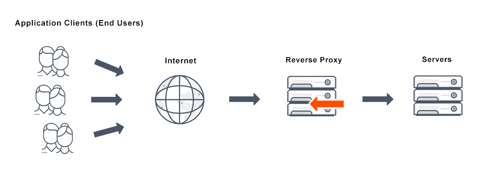

# NGINX Reverse Proxy :computer:

Earlier on in the week we discussed that typing an IP address into the URL bar would be difficult for any user,
these are lengthy numbers and people aren't likely to remember them, so instead we used "development.local:3000/"

When handing over a server to a client, we want to be able to remove the "/3000" at the end, we can do this via
reverse proxy. Therefore, our Node Application will run from that address.

NGINX will listen for requests on port 80 and pass them onto our app on port 3000

## Topics 

### 1) What is A Reverse Proxy

### 2) Creating Our Own Reverse Proxy

### 3) Automating This Process Using Bash Scripts

---


### What is a Reverse Proxy Server

- A type of proxy server that sits behind the firewall in a private network and directs client requests to the appropriate
backend server.
- Reverse Proxies are implemented to help security, performance as well as managing flow of traffic to the website




---

### Creating Our Reverse Proxy

- Within sites-available, we have a default server that acts as the homepage for NGINX, in order to change the process we must
delete the default page and recreate a new one with the configurations we would like

- Once the VM is up and running, vagrant ssh into the VM named app and make your way to the location of 'sites available'
which can be found on the path below:

```bash
cd /etc/nginx/sites-available
```

- Once here we can delete the default file by running ..
```
sudo rm -r default
```
We can now create a new default file and enter it ... 

```bash
sudo touch default
sudo nano default
```
Then add the configurations that we would like..

```bash
server {
    listen 80;
    server_name _;
    location / {
        proxy_pass http://localhost:3000;
        proxy_http_version 1.1;
        proxy_set_header Upgrade $http_upgrade;
        proxy_set_header Connection 'upgrade';
        proxy_set_header Host $host;
        proxy_cache_bypass $http_upgrade;
    }
}

```

```bash

```
---

### Automating This Process Using Bash Scripts


```bash
echo "server{listen 80;
  listen 80;
  location / {
      proxy_pass http://192.168.10.100.3000;
  }
}" >> reverse-proxy.conf
```
